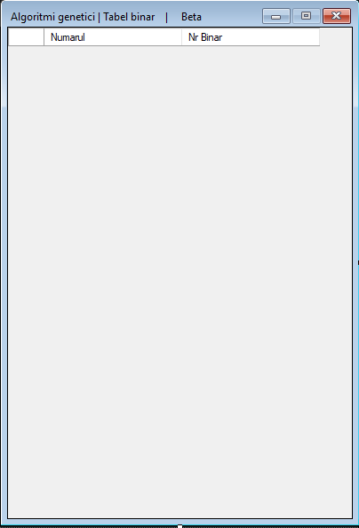
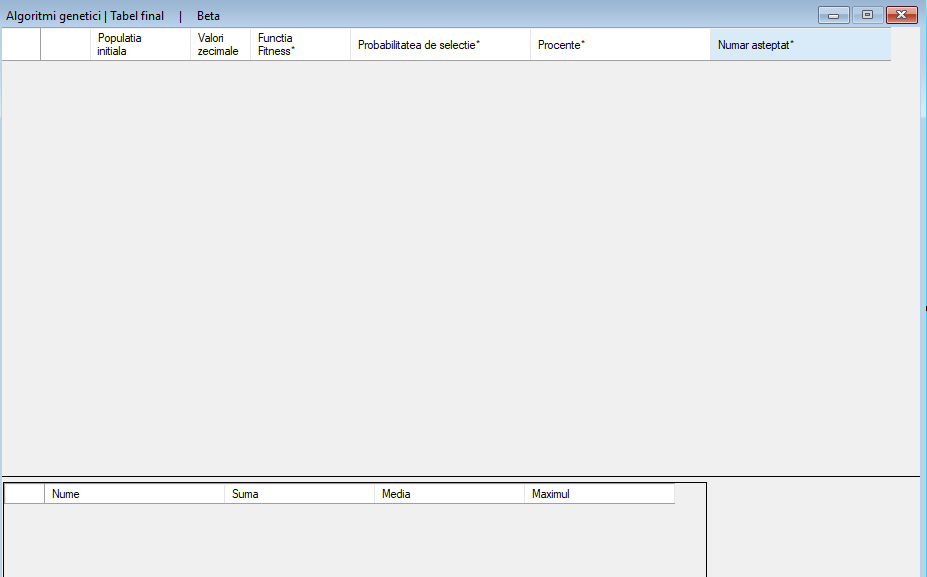

Genetic Algorithms Tool
=======================

Overview
--------

The Genetic Algorithms Tool is a Windows Forms application designed to demonstrate the principles of genetic algorithms through the evaluation of polynomial functions. Developed using C#, this tool allows users to define polynomial functions of varying degrees, evaluate them over a specified interval, and calculate fitness-related metrics such as probability, percentage, and expected number of selections. The application includes multiple forms to handle input, binary representation, and result visualization.
Features

--------

* **Polynomial Function Evaluation**: Supports linear, quadratic, cubic, and quartic polynomial functions with user-defined coefficients.
* **Interval Specification**: Allows users to set a range of integer values for function evaluation.
* **Fitness Metrics**: Computes fitness values, selection probabilities, percentages, and expected numbers for each input value.
* **Binary Representation**: Displays the binary representation of input values based on the interval length.
* **User Interface**: Intuitive interface with radio buttons for function selection, text boxes for coefficient input, and data grids for result display.

Technologies Used
-----------------

* **C#**: Primary programming language for implementing the genetic algorithm logic and UI.
* **Windows Forms**: Framework for building the graphical user interface.
* **Visual Studio**: Development environment for coding and debugging.

Installation
------------

1. **Prerequisites**:
   * Install Visual Studio with .NET Framework support.
2. **Setup**:
   * Clone the repository or download the project files.
   * Open the solution file (`.sln`) in Visual Studio.
   * Build the solution to compile the application.
3. **Running the Application**:
   * Launch the application from Visual Studio or the generated executable.
   * Use the main form to configure and evaluate the genetic algorithm.

Usage
-----

1. **Main Form (Configuration)**:
   
   * **Function Selection**: Choose the polynomial degree using radio buttons (Linear, Quadratic, Cubic, Quartic).
   * **Coefficient Input**: Enter coefficients (a, b, c, d, e) in the respective text boxes based on the selected function.
   * **Interval Input**: Specify the start and end of the interval in the provided text boxes.
   * **Run**: Click the button to process the input and display results in secondary forms.
   * **Exit**: Closing the form opens a confirmation dialog.

2. **Binary Representation Form**:
   
   * Automatically displays a table of integer values within the specified interval and their binary representations.

3. **Results Form**:
   
   * Shows a detailed table with input values, binary representations, fitness function results, probabilities, percentages, and expected numbers.
   * Includes summary statistics (sum, mean, maximum) for each metric.

Algorithm Details
-----------------

* **Polynomial Evaluation**: Calculates the function value for each integer in the specified interval based on the selected degree:
  * Linear: ( f(x) = a \cdot x + b )
  * Quadratic: ( f(x) = a \cdot x^2 + b \cdot x + c )
  * Cubic: ( f(x) = a \cdot x^3 + b \cdot x^2 + c \cdot x + d )
  * Quartic: ( f(x) = a \cdot x^4 + b \cdot x^3 + c \cdot x^2 + d \cdot x + e )
* **Fitness Metrics**:
  * Fitness: Direct output of the polynomial function.
  * Probability: Ratio of fitness to the sum of all fitness values.
  * Percentage: Probability multiplied by 100.
  * Expected Number: Ratio of fitness to the mean fitness.
* **Binary Conversion**: Pads binary representations with leading zeros to match the length of the maximum interval value.

Security
--------

* Input validation restricts coefficient and interval values to digits 0-9.
* No persistent data storage; all calculations are performed in memory.

Future Improvements
-------------------

* **Genetic Operations**: Implement selection, crossover, and mutation to create a full genetic algorithm.
* **Graphical Visualization**: Add charts to visualize fitness landscapes.
* **Multi-Threading**: Optimize performance for larger intervals.
* **Error Handling**: Enhance input validation and error messages.

License
-------

This project is licensed under the MIT License. See the [LICENSE](LICENSE) file for details.
Acknowledgments

---------------

Developed by Mihai Lungu as an educational project to explore genetic algorithms.

* * *

